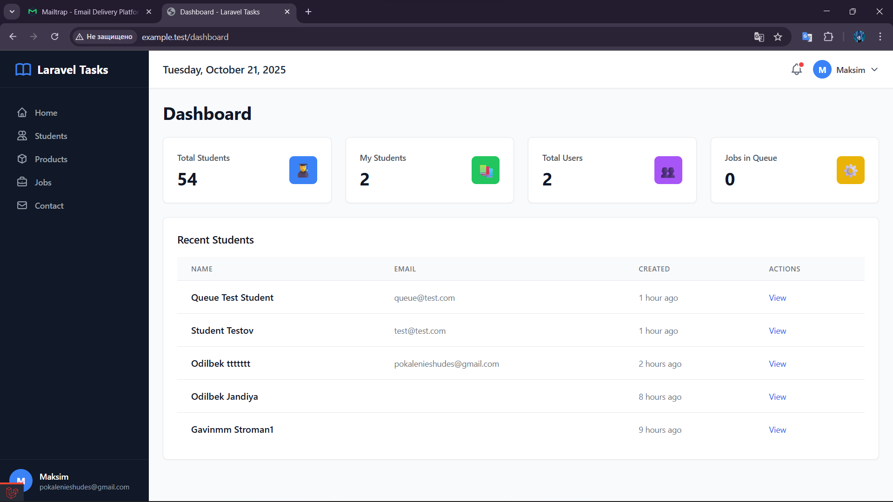
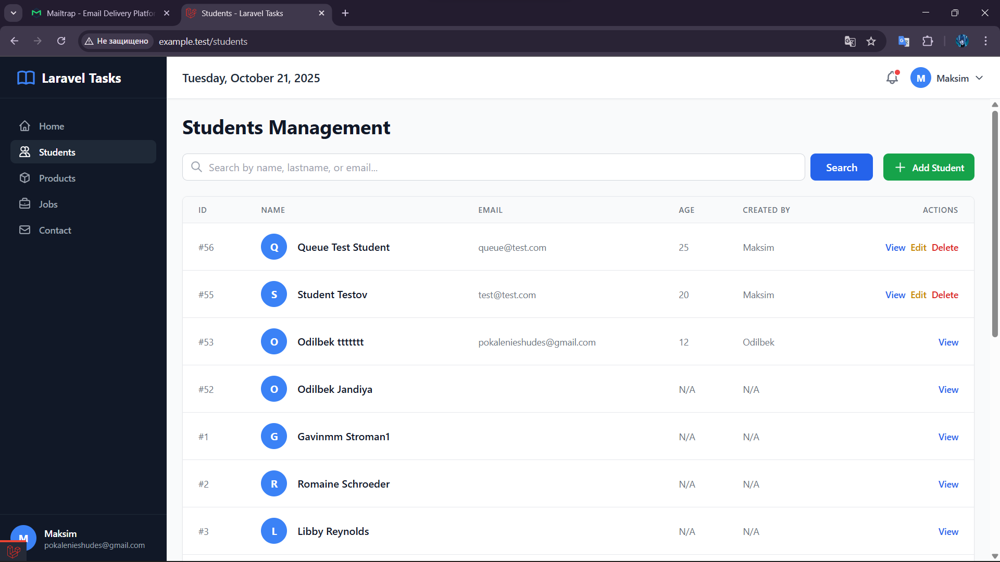
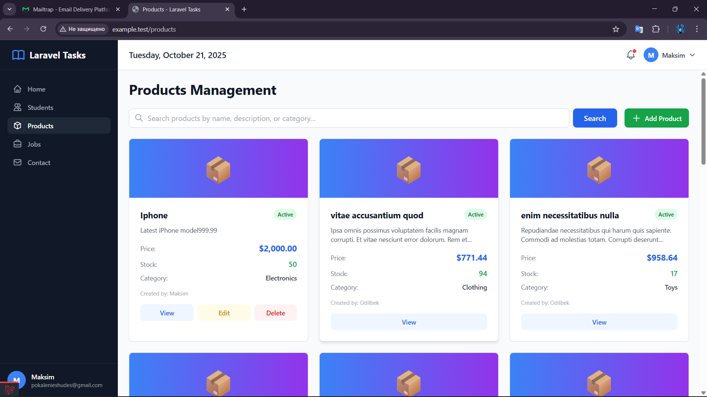
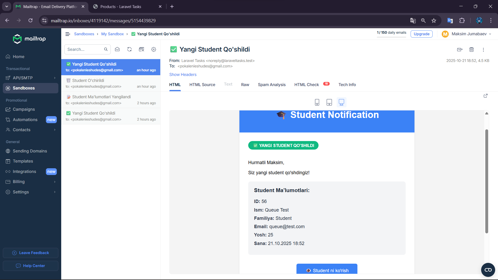
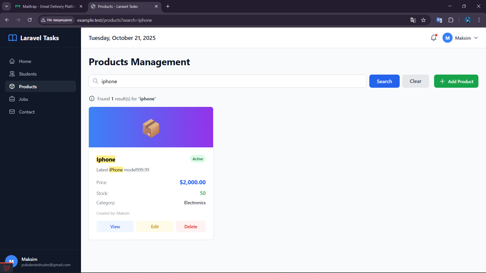
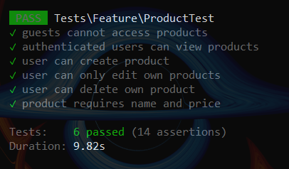

# 📚 Laravel Tasks - Full-Stack Web Application

<p align="center">
  
</p>

<p align="center">
  
  
  
  
  
</p>

<p align="center">
  
  
  
  
  
</p>

<p align="center">
  <strong>A modern and professional Laravel web application featuring CRUD operations, Authentication, Authorization, Email notifications, Background Jobs, Search functionality, and more!</strong>
</p>

---

## 🎯 About The Project

**Laravel Tasks** is a comprehensive full-stack web application built with Laravel framework, showcasing all essential and advanced features commonly used in modern web development. This project was created by completing 30 progressive tasks, each focusing on different aspects of Laravel ecosystem.

**Purpose:** Deep dive into Laravel framework and create a professional-grade portfolio project demonstrating real-world development patterns and best practices.

**Live Demo:** *Coming soon...*

---

## ✨ Key Features

### 🔐 Authentication (Manual Implementation - No Breeze/Jetstream)
- ✅ User Registration with email validation
- ✅ Login/Logout with session management
- ✅ Password Hashing (bcrypt)
- ✅ "Remember Me" functionality
- ✅ CSRF Protection

### 👥 Students Management (Full CRUD)
- ✅ **Create** - Add new students
- ✅ **Read** - View students list with pagination
- ✅ **Update** - Edit student information
- ✅ **Delete** - Remove students
- ✅ Custom validation with error messages
- ✅ User relationship (each student belongs to a creator)

### 📦 Products Management (Full CRUD)
- ✅ Complete CRUD operations
- ✅ Factory & Seeder (test data generator)
- ✅ Category filtering
- ✅ Stock management
- ✅ Active/Inactive status toggle

### 🔒 Authorization (Gates & Policies)
- ✅ Gate: `edit-student` (users can only edit their own students)
- ✅ StudentPolicy (view, create, update, delete methods)
- ✅ `@can` directive in Blade views
- ✅ 403 Forbidden error handling

### 📧 Email Notifications
- ✅ Mailtrap integration (email testing service)
- ✅ StudentPosted Mailable class
- ✅ Responsive HTML email templates
- ✅ Dynamic content for create/update/delete events

### ⚙️ Queue & Background Jobs
- ✅ Database queue driver
- ✅ StudentJob (logging to file)
- ✅ Queued email sending (background processing)
- ✅ Queue worker (`php artisan queue:work`)
- ✅ Performance optimization (instant user response)

### 🔍 Search Functionality
- ✅ Students search (name, lastname, email)
- ✅ Products search (name, description, category)
- ✅ Query scope (`scopeSearch`)
- ✅ Results highlighting (yellow background)
- ✅ Empty state handling

### 🎨 Modern UI/UX
- ✅ Dashboard layout (sidebar + header)
- ✅ TailwindCSS (utility-first CSS framework)
- ✅ Alpine.js (lightweight JavaScript framework)
- ✅ Responsive design (mobile, tablet, desktop)
- ✅ Reusable Blade components
- ✅ Statistics cards on dashboard

### 🧪 Testing
- ✅ Feature Tests (PHPUnit)
- ✅ 6 tests for Products module (14 assertions)
- ✅ Test coverage: Guest access, CRUD operations, Authorization

---

## 🛠️ Built With

| Technology | Version | Purpose |
|------------|---------|---------|
| **Laravel** | 12.31.1 | Backend Framework |
| **PHP** | 8.4.13 | Programming Language |
| **SQLite** | 3.x | Database (Development) |
| **TailwindCSS** | 3.x (CDN) | Frontend Styling |
| **Alpine.js** | 3.x (CDN) | Lightweight JavaScript |
| **Mailtrap** | - | Email Testing Service |
| **PHPUnit** | 11.x | Testing Framework |

---

## 📂 Project Structure

```
laravelTasks/
├── app/
│   ├── Http/Controllers/
│   │   ├── AuthController.php          # Manual authentication
│   │   ├── StudentController.php       # Students CRUD
│   │   └── ProductController.php       # Products CRUD
│   ├── Models/
│   │   ├── User.php                    # User model with relationships
│   │   ├── Student.php                 # Student model with search scope
│   │   └── Product.php                 # Product model with scopes
│   ├── Mail/
│   │   └── StudentPosted.php           # Email notification class
│   ├── Jobs/
│   │   └── StudentJob.php              # Background job for logging
│   └── Policies/
│       └── StudentPolicy.php           # Authorization policy
│
├── database/
│   ├── migrations/                     # 15+ database migrations
│   ├── factories/
│   │   └── ProductFactory.php          # Fake data generator
│   └── seeders/
│       └── ProductSeeder.php           # Database seeder
│
├── resources/views/
│   ├── components/
│   │   ├── dashboard-layout.blade.php  # Main layout component
│   │   ├── sidebar.blade.php           # Navigation sidebar
│   │   ├── dashboard-header.blade.php  # Header with dropdown
│   │   ├── stat-card.blade.php         # Statistics card component
│   │   └── alert.blade.php             # Alert component
│   ├── students/                       # Students CRUD views
│   ├── products/                       # Products CRUD views
│   ├── auth/                           # Login/Register forms
│   └── emails/
│       └── student-posted.blade.php    # Email template
│
├── tests/Feature/
│   └── ProductTest.php                 # Feature tests (6 tests)
│
└── routes/web.php                      # Application routes
```

---

## 🚀 Getting Started

### Prerequisites

- PHP >= 8.2
- Composer
- SQLite (or MySQL/PostgreSQL)
- Node.js & NPM (optional, for asset compilation)

### Installation

#### 1. Clone the repository
```bash
git clone https://github.com/GAMaksim/laravelTasks.git
cd laravelTasks
```

#### 2. Install dependencies
```bash
composer install
```

#### 3. Environment setup
```bash
cp .env.example .env
php artisan key:generate
```

#### 4. Configure database
The project uses SQLite by default. Create the database file:
```bash
touch database/database.sqlite
```

Update `.env` file:
```env
DB_CONNECTION=sqlite
DB_DATABASE=/absolute/path/to/database.sqlite
```

#### 5. Run migrations
```bash
php artisan migrate
```

#### 6. Seed the database (Optional)
```bash
php artisan db:seed --class=ProductSeeder
```

#### 7. Start the development server
```bash
php artisan serve
```

Visit: **http://127.0.0.1:8000**

---

## 🧪 Running Tests

Run all tests:
```bash
php artisan test
```

Run specific test:
```bash
php artisan test --filter=ProductTest
```

**Expected Output:**
```
PASS  Tests\Feature\ProductTest
✓ guests cannot access products
✓ authenticated users can view products
✓ user can create product
✓ user can only edit own products
✓ user can delete own product
✓ product requires name and price

Tests:  6 passed (14 assertions)
Duration: 9.82s
```

---

## ⚙️ Queue Worker (Background Jobs)

To process background jobs (emails and logging):

```bash
php artisan queue:work
```

**Important:** Keep this terminal window open while testing queue functionality.

---

## 📧 Email Configuration (Mailtrap)

For email testing, sign up at [Mailtrap.io](https://mailtrap.io) and update your `.env` file:

```env
MAIL_MAILER=smtp
MAIL_HOST=sandbox.smtp.mailtrap.io
MAIL_PORT=2525
MAIL_USERNAME=your_mailtrap_username
MAIL_PASSWORD=your_mailtrap_password
MAIL_ENCRYPTION=null
MAIL_FROM_ADDRESS="noreply@laraveltasks.test"
MAIL_FROM_NAME="Laravel Tasks"
```

Then clear config cache:
```bash
php artisan config:clear
```

---

## 📊 Project Statistics

| Metric | Value |
|--------|-------|
| **Tasks Completed** | 30/30 (100%) |
| **Total Lines of Code** | 3,500+ |
| **Git Commits** | 40+ |
| **Models** | 10+ |
| **Controllers** | 8+ |
| **Blade Views** | 25+ |
| **Migrations** | 15+ |
| **Feature Tests** | 6 (14 assertions) |
| **Components** | 10+ |
| **Development Time** | 12-15 hours |

---

## 🎓 Concepts Learned

### Backend Development:
- ✅ MVC Architecture
- ✅ Eloquent ORM (Models, Relationships)
- ✅ Query Builder & Query Scopes
- ✅ Database Migrations & Schema
- ✅ Form Validation (Custom Rules & Messages)
- ✅ Authorization (Gates & Policies)
- ✅ Authentication (Session-based)
- ✅ Email Notifications (Mailable Classes)
- ✅ Queue & Background Jobs
- ✅ Factories & Seeders

### Frontend Development:
- ✅ Blade Template Engine
- ✅ Component-Based Architecture
- ✅ TailwindCSS (Utility-First CSS)
- ✅ Alpine.js (Reactive Components)
- ✅ Responsive Web Design
- ✅ Form Handling & Validation

### Testing:
- ✅ Feature Testing
- ✅ PHPUnit Framework
- ✅ Test Database
- ✅ Assertions & Test Coverage

### Tools & Workflow:
- ✅ Git Version Control
- ✅ Composer Dependency Management
- ✅ Artisan CLI Commands
- ✅ Mailtrap Email Testing

---

## 🔑 Main Routes

| URL | Method | Description | Auth Required |
|-----|--------|-------------|---------------|
| `/` | GET | Home page | No |
| `/register` | GET/POST | User registration | No |
| `/login` | GET/POST | User login | No |
| `/logout` | POST | User logout | Yes |
| `/dashboard` | GET | Dashboard with stats | Yes |
| `/students` | GET | Students list | Yes |
| `/students/create` | GET | Create student form | Yes |
| `/students/{id}` | GET | Student details | Yes |
| `/students/{id}/edit` | GET/PUT | Edit student | Yes (owner only) |
| `/students/{id}` | DELETE | Delete student | Yes (owner only) |
| `/products` | GET | Products list | Yes |
| `/products/create` | GET | Create product form | Yes |
| `/products/{id}` | GET | Product details | Yes |
| `/products/{id}/edit` | GET/PUT | Edit product | Yes (owner only) |
| `/products/{id}` | DELETE | Delete product | Yes (owner only) |

---

## 🎯 Features Showcase

### 1️⃣ Dashboard
- **Real-time statistics:** Total Students, My Students, Total Users, Jobs in Queue
- **Recent activity:** Latest students table
- **Modern card-based design** with gradient backgrounds
- **Responsive layout** for all screen sizes

### 2️⃣ Students Management
- **Full CRUD operations** with authorization checks
- **Search functionality** (name, lastname, email)
- **Pagination** (15 items per page)
- **User-specific data** (view and edit only your own students)
- **Professional table layout** with actions column

### 3️⃣ Products Management
- **Grid card layout** with modern design
- **Category filtering**
- **Stock tracking** (in stock / out of stock indicators)
- **Active/Inactive status** toggle
- **Search** (name, description, category)
- **Factory-generated test data**

### 4️⃣ Email Notifications
- **Automatic emails** on student create/update/delete
- **HTML templates** with responsive styling
- **Background processing** via Queue
- **Mailtrap integration** for safe testing

### 5️⃣ Authorization System
- **Gates:** Simple authorization rules
- **Policies:** Model-specific permissions
- **Blade directives:** `@can`, `@cannot`
- **403 Forbidden:** Proper error handling

### 6️⃣ Testing Suite
- **Comprehensive test coverage**
- **Guest access protection tests**
- **CRUD operation tests**
- **Authorization tests**
- **Validation tests**
- **100% passing tests**

---

## 🚀 Future Enhancements

Potential features to add:

- [ ] **Image upload** (student/product photos with storage)
- [ ] **Export functionality** (Excel/PDF reports)
- [ ] **Advanced filtering** (date range, multiple criteria)
- [ ] **REST API** (JSON endpoints for mobile apps)
- [ ] **Real-time notifications** (Pusher/WebSockets)
- [ ] **Multi-language support** (i18n/localization)
- [ ] **User roles & permissions** (Admin, Manager, User)
- [ ] **Dashboard charts** (Chart.js/ApexCharts)
- [ ] **Email verification** (verified users only)
- [ ] **Password reset** (forgot password functionality)
- [ ] **Two-factor authentication** (2FA)
- [ ] **Activity log** (user actions tracking)
- [ ] **File uploads** (documents, attachments)
- [ ] **Comments system** (student/product comments)
- [ ] **Tags & categories** (better organization)

---

## 📸 Screenshots

### Dashboard


### Students List


### Products Grid


### Mailtrap email


### Search Results


### Test results


---

## 🤝 Contributing

This is an educational project created for learning purposes. Contributions, issues, and feature requests are welcome!

Feel free to check the [issues page](https://github.com/GAMaksim/laravelTasks/issues) if you want to contribute.

### How to Contribute

1. Fork the Project
2. Create your Feature Branch (`git checkout -b feature/AmazingFeature`)
3. Commit your Changes (`git commit -m 'Add some AmazingFeature'`)
4. Push to the Branch (`git push origin feature/AmazingFeature`)
5. Open a Pull Request

---

## 📄 License

This project is open-source and available under the [MIT License](LICENSE).

---

## 👨‍💻 Author

**Maksim Gavrilov**

- GitHub: [@GAMaksim](https://github.com/GAMaksim)
- Email: pokalenieshudes@gmail.com
- Project Link: [https://github.com/GAMaksim/laravelTasks](https://github.com/GAMaksim/laravelTasks)

---

## 🙏 Acknowledgments

Special thanks to:

- [Laravel Framework](https://laravel.com) - The PHP framework for web artisans
- [TailwindCSS](https://tailwindcss.com) - A utility-first CSS framework
- [Alpine.js](https://alpinejs.dev) - A rugged, minimal framework
- [Mailtrap](https://mailtrap.io) - Email testing solution
- [Laracasts](https://laracasts.com) - The best place to learn Laravel
- [Laravel Daily](https://laraveldaily.com) - Laravel tutorials and tips

---

## 📚 Learning Resources

If you want to learn Laravel, here are some great resources:

- **Official Documentation:** [https://laravel.com/docs](https://laravel.com/docs)
- **Laracasts:** [https://laracasts.com](https://laracasts.com) (Video tutorials)
- **Laravel News:** [https://laravel-news.com](https://laravel-news.com) (Latest updates)
- **Laravel Daily:** [https://laraveldaily.com](https://laraveldaily.com) (Practical tips)
- **Laravel Bootcamp:** [https://bootcamp.laravel.com](https://bootcamp.laravel.com) (Official course)

---

## 💡 Development Notes

### Design Decisions

**Why SQLite?**
- Zero configuration for development
- Perfect for learning and prototypes
- Easy to share (single file database)
- Can be easily switched to MySQL/PostgreSQL in production

**Why Manual Authentication?**
- Better understanding of authentication flow
- Learn session management
- Understand password hashing
- No magic, full control

**Why TailwindCSS (CDN)?**
- Quick prototyping
- No build step required
- Perfect for learning
- Easy to switch to npm version later

**Why Alpine.js?**
- Lightweight (15kb)
- Vue-like syntax
- No build step
- Perfect for small interactions

---

## 🐛 Known Issues

None at the moment! 🎉

If you find any bugs, please [open an issue](https://github.com/GAMaksim/laravelTasks/issues).

---

## 📝 Changelog

### Version 1.0.0 (2025-10-21)
- ✅ Initial release
- ✅ 30/30 tasks completed
- ✅ Full CRUD for Students & Products
- ✅ Authentication & Authorization
- ✅ Email notifications
- ✅ Queue & background jobs
- ✅ Search functionality
- ✅ Modern dashboard
- ✅ Feature tests

---

<p align="center">
  <strong>⭐ If you like this project, please give it a star on GitHub! ⭐</strong>
</p>

<p align="center">
  Made with ❤️ and ☕ by <a href="https://github.com/GAMaksim">Maksim</a>
</p>

<p align="center">
  <sub>Built with Laravel 12 • October 2025</sub>
</p>